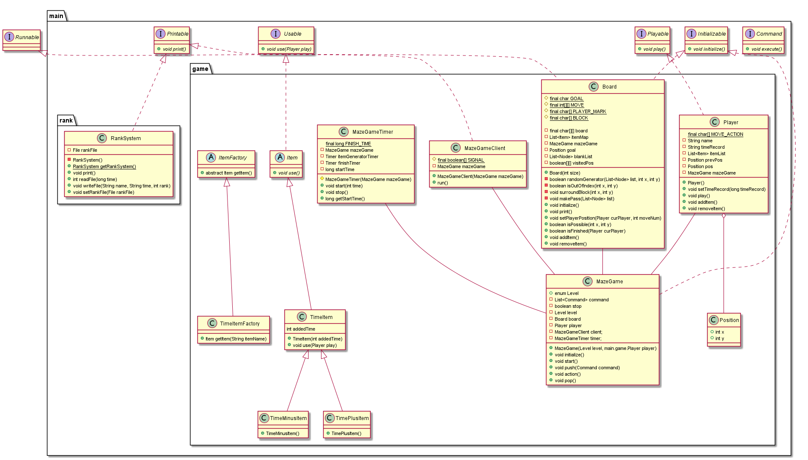

# maze-game
A simple maze Game written in Java

* 미로를 랜덤하게 생성하며, 해당 미로를 탈출하는 게임

## 1. 프로젝트 주제
* 임의 생성 미로 탈출 게임

## 2. 프로젝트 기간
* 2020.10.14 ~ 2020.10.21

## 3. 프로젝트 내용
1. Set up
    * JDK Version : 14
    * OS : Mac, Windows 7
2. 구현 내용
    1. Maze
        * Singleton Pattern 사용(Lazy Instantiation)
        * 게임이 시작하면 랜덤하게 생성
        * 난이도에 따라 미로 변경(맵 크기 늘리기)
            * 맵 한 칸당 Array[3][3]로 설정    
            * Beginner : 5*5
            * Intermediate : 10*10
            * Expert : 15*15
        * Timer 동작
    2. Item(추가 사항)
        * Factory Method Pattern 사용
        * 위치는 램덤하게 아이템 생성
        * Item 종류 
            * 최종 시간을 늘리는/줄이는 아이템
    3. Player
        * Maze - User, Observer Pattern 사용
        * w, s, a, d 키 입력으로 움직임 설정
    4. Rank System
        * Time Over 시, 랭킹에 등록되지 않는다.
        * 1등부터 10등까지 등록
        * 랭크 파일에 저장(파일 입출력)
        
## 4. 유저 시나리오
* Maze는 게임 시작 시, 자동으로 랜덤하게 생성해서 출력한다.
* 목표는 빨리 탈출하는 것, (랭킹 시스템: DB 사용 X, 파일 입출력으로 진행)
    1) Game Start
    2) Level 설정(Beginner, Intermediate, Advanced)
    3) Player 이름 설정
    4) Game Play & Timer Start
    5) 일정 시간 안에 탈출 & 시간이 오버되면 강제 종료
    6) 랭킹 등록

## 5. 소프트웨어 구조 설계
* Class DIagram

